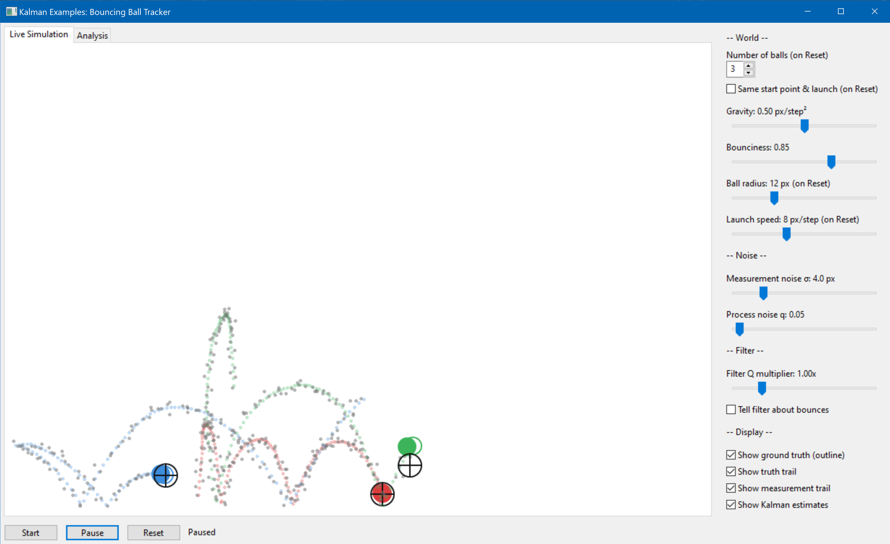
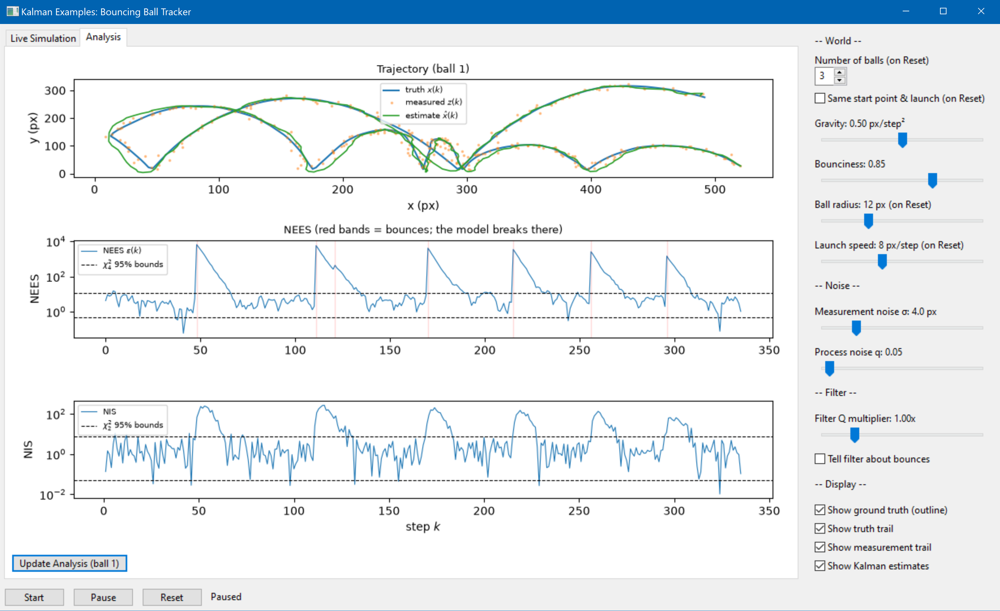

# kalman_examples

An interactive educational demo for experimenting with Kalman filtering. 

This repo will eventually be split into several demos of increasing complexity. 

In the current demo, balls bounce around a field under gravity, while a noisy sensor measures their **positions only**.
There is one Kalman filter per ball that estimates position **and velocity** from the noisy measurements. Sidebar controlls
are used to change the 'world', the noise, and the filter tuning to see the impact of these controls live.

This also demonstrates what happens when the filter's model is wrong, and how that shows up in the
standard consistency metrics (NEES / NIS with chi-squared bounds).


## Table of Contents

- [Requirements](#requirements)
- [Running](#running)
- [File Structure](#file-structure)
- [The GUI](#the-gui)
  * [Live Simulation tab](#live-simulation-tab)
  * [Analysis tab](#analysis-tab)
  * [Sidebar controls](#sidebar-controls)
- [The Headless Monte Carlo Study](#the-headless-monte-carlo-study)
- [Implementation Notes](#implementation-notes)
- [Architecture and Flow](#architecture-and-flow)
- [Development and future work](#development-and-future-work)
- [References](#references)

## Requirements

This project requires numpy, scipy, matplotlib, and wxPython.

Tested on Python 3.12.

Use `pip install -r requirements.txt` to install the following dependencies:

```
numpy
scipy
matplotlib
wxPython
```

## Running

```
cd src
python run_gui.py          # interactive GUI
python run_headless.py     # Monte Carlo consistency study (report plots)
python run_headless.py 200 # same, with 200 runs instead of the default 50
```

## File Structure

```
kalman_examples/
├── README.md
├── requirements.txt
├── media/
└── src/
    ├── ball.py
    ├── kalman_filter.py
    ├── models.py
    ├── metrics.py
    ├── tracked_ball.py
    ├── run_gui.py
    └── run_headless.py
```

```
ball.py             The world. Honest projectile physics with wall bounces
                    (restitution, overshoot mirroring) plus REAL random
                    acceleration -- the process noise the filter's Q models.
                    Reports which axis bounced each step.
kalman_filter.py    Generic linear Kalman filter (KalmanFilter class).
                    Separate predict()/update() calls, optional control
                    input B u, Joseph-form covariance update, and exposes
                    the innovation and its covariance S for diagnostics.
models.py           The state-space model: F, B, H, Q, R for the
                    [x, y, vx, vy] ball, matching ball.py's kinematics
                    exactly, plus the first-measurement P0 helper.
metrics.py          Consistency metrics: NEES, NIS, chi-squared interval
                    bounds, and the tighter bounds for Monte-Carlo-averaged
                    NEES (scipy.stats.chi2).
tracked_ball.py     Couples one ball + one noisy sensor + one filter
                    (TrackedBall class) and records the aligned histories
                    (truth, measurements, estimates, NEES, NIS, bounces)
                    used by both front ends.
run_gui.py          Entry point for the wxPython GUI: live canvas, sidebar
                    controls, matplotlib analysis tab.
run_headless.py     Entry point for the Monte Carlo consistency study --
                    no GUI required; produces the report plots.
```


### Examples

`example 1` - this is the core, and only, demo included right now. It has been verified numerically: 
over 60 Monte Carlo runs with a matched filter, mean NEES = 3.96 (theory: 4.0), mean NIS = 2.00 (theory: 2.0), 
and the averaged NEES stays within its chi-squared bounds for 95% of steps.


Each example is built around a standard structure. There are two front ends, and one operational 'engine'. 
The two front ends, a wxPython GUI and a headless Monte Carlo script, are used to experiment live or collect data. 
The Monte Carlo script is a simple formal consistency study (averaged NEES against chi-squared bounds, matched
vs. mistuned filters).


## The GUI

### Live Simulation tab

<p align="center">
  <!-- image: live simulation tab with all display layers labeled -->
  
</p>

Per ball, the canvas draws:

| Marker | Meaning |
| ------ | ------- |
| filled colored circle | latest noisy **measurement** -- the only thing the filter ever sees |
| small gray dots | measurement trail |
| colored outline circle (no fill) | **ground truth** (toggleable) |
| pale colored dots | truth trail |
| black ring + crosshair | **Kalman estimate** |

Watch the black estimate ring hug the truth outline more tightly than the
filled measurement ball jitters around it -- that's the filter earning its
keep, on position it *measures* and velocity it never does.

### Analysis tab

<p align="center">
  <!-- image: analysis tab, trajectory + NEES + NIS plots -->
  
</p>

Press *Update Analysis* for the classic report plots for ball 1:

- **Trajectory** -- truth vs. measured vs. estimated path.
- **NEES** with chi-squared 95% bounds (df = 4, the state dimension); bounce
  moments are shaded red, since each bounce violates the filter's ballistic
  model and the metric reacts instantly.
- **NIS** with its own bounds (df = 2, the measurement dimension). NIS needs
  no ground truth -- this is the metric you can monitor on a real system.

### Sidebar controls

| Group | Control | Effect |
| ----- | ------- | ------ |
| World | Number of balls | how many balls + filters (applied on Reset) |
| World | Same start point & launch | all balls get an identical position and velocity on Reset, so only the noise realizations differ -- for filter-vs-filter comparison |
| World | Gravity | downward acceleration, live |
| World | Bounciness | restitution: fraction of speed kept per bounce, live |
| World | Ball radius / Launch speed | applied on Reset |
| Noise | Measurement noise sigma | sensor noise std in px, live (world **and** filter R) |
| Noise | Process noise q | real random-acceleration variance, live (world **and** filter Q) |
| Filter | Filter Q multiplier | mistunes the filter's Q **only** -- the world is unchanged. x1.0 = matched |
| Filter | Tell filter about bounces | on a bounce, reflect the filter's velocity belief on the bounced axis and inflate its variance |
| Display | Show ground truth / truth trail / measurement trail / Kalman estimates | toggle each canvas layer |


## The Headless Monte Carlo Study

A single run's NEES is noisy: any one step can poke outside the chi-squared
bounds by chance. The textbook consistency test AVERAGES NEES over many
independent runs; the average has much tighter chi-squared bounds
(chi2(N*dof)/N). `run_headless.py` produces three figures on a huge field
(no bounces, so the linear model is exact):

<p align="center">
  <!-- image: headless figure 2, single vs averaged NEES -->
  
</p>

- **Fig 1** -- one run: trajectory, truth vs. measurements vs. estimate.
- **Fig 2** -- single-run NEES vs. the 50-run average, with both bound sets,
  on a matched filter.
- **Fig 3** -- the same averaged NEES when the filter's Q is mistuned
  (overconfident x0.1 and pessimistic x10): mistuning that hides in a single
  run is unmistakable in the average.

## Implementation Notes

Design decisions worth knowing about (several are common pitfalls in
hand-rolled Kalman code):

* **The world and the filter are strictly separated.** Real process noise is
  random acceleration injected in `ball.py`; the filter never adds randomness,
  it only models it via Q. Filters model randomness, they don't add it.
* **The filter's model matches the physics exactly.** `ball.py`'s kinematic
  step and `models.py`'s F and B are the same equations, so "matched filter"
  genuinely means matched and the NEES consistency tests are honest. Gravity
  enters as a known control input through B = [0, -dt^2/2, 0, -dt]'.
* **H is a proper 2x4 measurement matrix.** Position only; velocity is
  inferred. This also keeps the innovation covariance S a healthy, invertible
  2x2.
* **Joseph-form covariance update** (`(I-KH)P(I-KH)' + KRK'`) instead of the
  short form, which is algebraically equal but can lose symmetry and
  positive-definiteness numerically over long runs.
* **NEES is computed against ground truth** with a true matrix quadratic form
  (`@`, never element-wise `*`), and the chi-squared bounds are derived from
  `scipy.stats.chi2.ppf` with explicit degrees of freedom rather than
  hard-coded table values.
* **Initialization from the first measurement** with honest velocity
  uncertainty (large P0 velocity variance), so there is no startup transient
  to explain away.
* **Bounce physics is energy-honest.** Restitution is applied at reflection,
  position overshoot is mirrored (no tunneling at speed), and `Ball.step()`
  reports which axis bounced so the optional bounce-aware filter mode
  reflects the correct velocity component.
* **One y-flip.** Physics lives in a `y-up` world; the flip to screen
  coordinates happens once, at draw time, in the GUI panel.
* All per-step histories (truth, measurement, estimate, NEES, NIS) stay
  index-aligned; the initialization step's NIS is recorded as NaN since it
  has no innovation.

## Architecture and Flow

This is provided as a reference for how the physics model (the ball), the sensor, and the filter are split. All examples
will follow this general structure. 

```
════════════ THE WORLD ════════════              ═══════════ THE ESTIMATOR ═══════════
  (truth + real randomness)                        (only ever sees measurements)

┌─────────────────────────────┐
│           ball.py           │
│ ─────────────────────────── │
│  kinematic step + gravity   │
│  + random accel ~ N(0, q)   │
│  wall bounces (restitution) │
│  → truth [x, y, vx, vy]     │
│  → (bounced_x, bounced_y)   │
└──────────────┬──────────────┘
               │ true position
               ▼
┌─────────────────────────────┐                 ┌─────────────────────────────┐
│        noisy sensor         │   z = pos + v   │      kalman_filter.py       │
│      (tracked_ball.py)      │ ──────────────► │ ─────────────────────────── │
│   v ~ N(0, r_std²) per axis │                 │  predict():  x = F x + B u  │
└─────────────────────────────┘                 │              P = F P F'+ Q  │
                                                │  update(z):  y = z - H x    │
        F, B, H, Q, R from models.py ─────────► │              S = H P H'+ R  │
        (same equations as ball.py;             │              K = P H' S⁻¹   │
         Q multiplier mistunes here)            │     Joseph-form P update    │
                                                └──────────────┬──────────────┘
                                                               │ estimate, innovation, S
               ┌───────────────────────────────────────────────┘
               ▼
┌─────────────────────────────────────────────┐
│               tracked_ball.py               │
│  records aligned histories per step:        │
│  truth | z | estimate | NEES | NIS | bounces│
│  (NEES/NIS via metrics.py + chi² bounds)    │
└──────┬───────────────────────────────┬──────┘
       │                               │
       ▼                               ▼
┌────────────────────┐       ┌──────────────────────┐
│     run_gui.py     │       │   run_headless.py    │
│  live canvas +     │       │  Monte Carlo study:  │
│  sidebar controls  │       │  averaged NEES vs    │
│  + analysis tab    │       │  chi² bounds,        │
│  (per-ball filter) │       │  matched vs mistuned │
└────────────────────┘       └──────────────────────┘
```

## Development and future work

* **Standard student experiment write ups** - for undergraduate students with 
some math background.
* **Obstacle maps from images** - parse a black/white image into a collision
  grid so balls bounce off arbitrary shapes, not just the four walls.
* **Extended / unscented filters** for a nonlinear measurement (e.g. a
  range+bearing sensor instead of x/y position).
* **Data association** - multiple balls, ONE sensor that doesn't say which
  ball a measurement came from (nearest-neighbor gating; the doorway to
  multi-target tracking).
* **IMM** - run a "ballistic" and a "just bounced" model in parallel and
  blend; the *Tell filter about bounces* toggle is a hand-rolled preview of
  the idea.
* **Analysis-tab ball selector** - the report plots currently always show
  ball 1; with the same-start comparison mode, selecting which ball to
  analyze is the natural next control.

## References

[1]: Y. Bar-Shalom, X. R. Li, and T. Kirubarajan, Estimation with Applications to Tracking and Navigation: Theory, Algorithms and Software. New York, NY, USA: Wiley, 2001.

[2]: R. R. Labbe Jr., "Kalman and Bayesian Filters in Python." [Online]. Available: <https://github.com/rlabbe/Kalman-and-Bayesian-Filters-in-Python>.

[3]: G. Welch and G. Bishop, "An Introduction to the Kalman Filter," Dept. of Computer Science, Univ. of North Carolina at Chapel Hill, TR 95-041. [Online]. Available: <https://www.cs.unc.edu/~welch/media/pdf/kalman_intro.pdf>.

[4]: R. E. Kalman, "A New Approach to Linear Filtering and Prediction Problems," Trans. ASME, J. Basic Eng., vol. 82, no. 1, pp. 35-45, 1960.